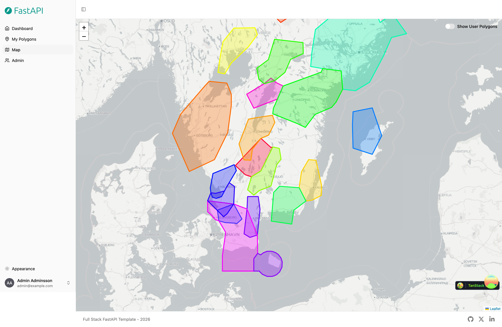
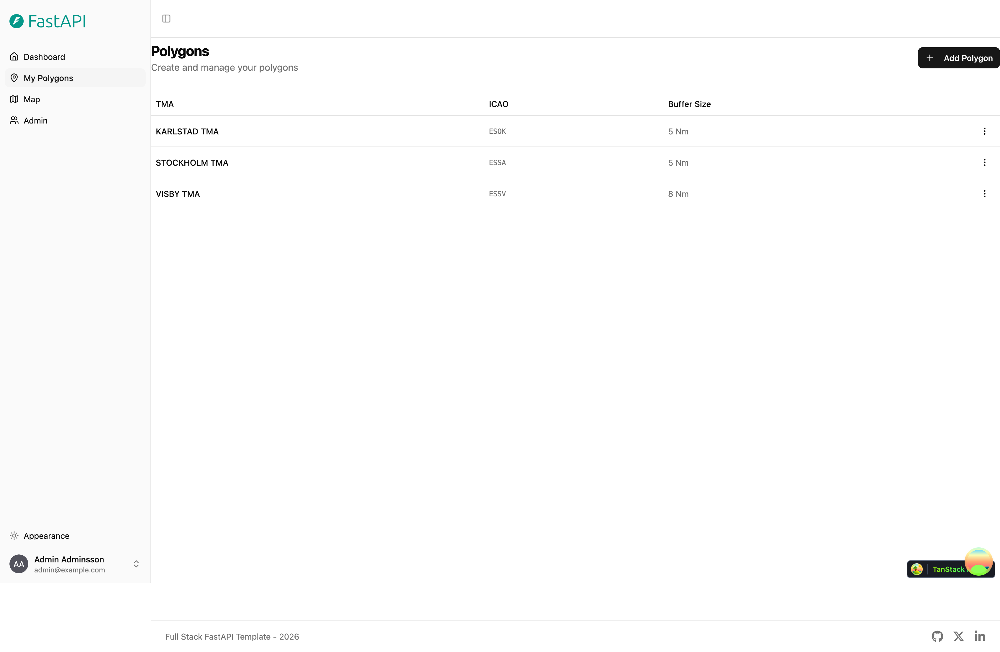
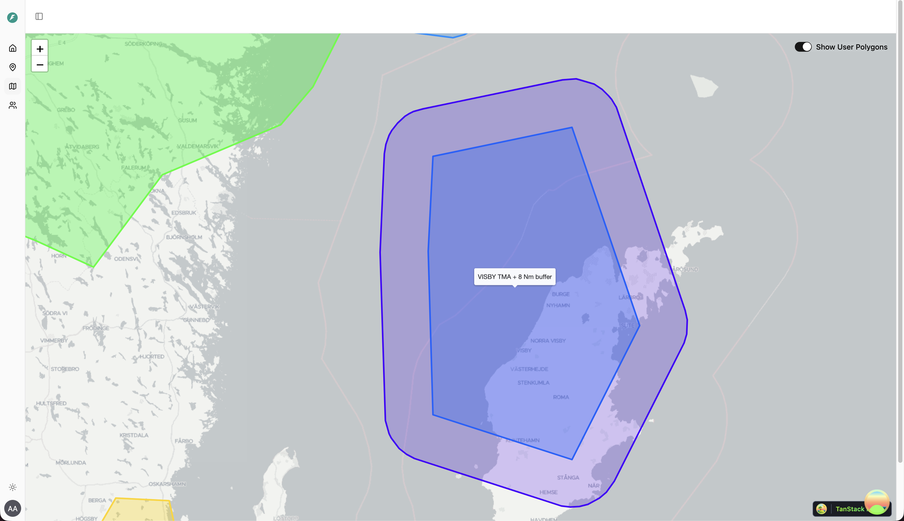

# Coord Buffer

Fullstack implementation of [Coord Buffer Cli](https://github.com/druwan/coord-buffer-cli). [Fast-API Fullstack template](https://github.com/fastapi/full-stack-fastapi-template/tree/0.10.0) used.

Visualizes all TMA's from eAIP Sweden: 

An user can then select any of the TMA's and apply a buffer (in Nm). 

The buffered polygon is then added to the map: 
